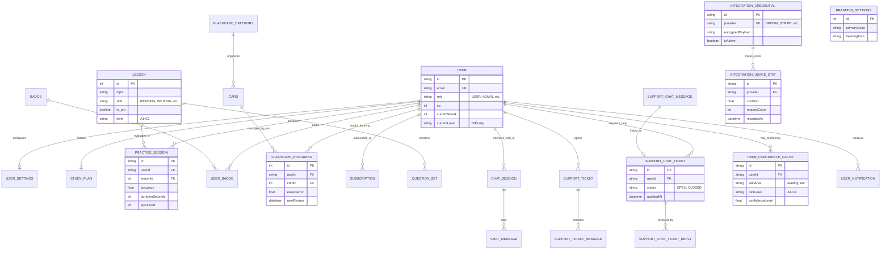
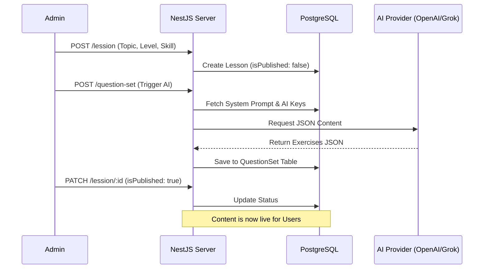

# Chessus Server 🧀

Backend for the ItalianMaster language learning platform. This is an AI-powered educational system designed to help users master Italian through dynamic lessons, gamification, and spaced-repetition flashcards.

## 🚀 Features

- **AI-Driven Lessons**: Dynamic content generation using OpenAI, Grok, and Gemini.
- **Gamification**: XP tracking, daily streaks, and automated badge awards.
- **Spaced Repetition System (SRS)**: Advanced flashcard scheduling for vocabulary retention.
- **CEFR Proficiency Tracking**: Real-time estimation of user levels (A1-C2).
- **Subscription Management**: Integrated with Stripe and Lemon Squeezy.

## 🛠 Tech Stack

- **Framework**: [NestJS](https://nestjs.com/)
- **ORM**: [Prisma](https://www.prisma.io/)
- **Database**: PostgreSQL
- **AI Integration**: OpenAI, Google Gemini, Grok
- **Payments**: Stripe, Lemon Squeezy
- **Storage**: Cloudinary

## 📊 Database Architecture

The following diagram illustrates the complete database structure, highlighting the relationships between users, learning content, gamification, and system configuration.

## 🔄 Lesson Management Workflow

The platform utilizes a sophisticated AI-driven content pipeline, divided into administrative creation and user consumption phases.

### 1. Admin Phase (Content Creation)
The creation phase orchestrates metadata setup with dynamic AI payload generation.

1.  **Initialization**: Admin creates a `Lesson` record defining the Topic, CEFR Level (A1-C2), and Skill Area (Reading, Grammar, etc.).
2.  **AI Generation**: The system retrieves the appropriate `SystemPrompt` and calls a configured AI Provider (OpenAI, Gemini, or Grok).
3.  **Schema Enforcement**: The AI returns a structured JSON payload (Passages, Questions, Answers) which is stored in the `QuestionSet` table.
4.  **Publication**: After review, the Admin sets `isPublished: true`, making the content live for users.

### 2. User Phase (Learning Consumption)
1.  **Discovery**: Users browse published lessons filtered by their current proficiency level.
2.  **Engagement**: The system serves the `QuestionSet` content.
3.  **Persistence**: Upon completion, a `PracticeSession` record is created, updating the user's XP, Streaks, and CEFR confidence level.

### 📊 Content Generation Sequence

## 🛠 Development

### Setup
1. Clone the repository
2. Install dependencies: `npm install`
3. Configure `.env` file (see `.env.example`)
4. Run migrations: `npx prisma migrate dev`
5. Start the server: `npm run dev`

### License
UNLICENSED
