# Chessus Server 🧀

Backend for the ItalianMaster language learning platform. This is an AI-powered educational system designed to help users master Italian through dynamic lessons, gamification, and spaced-repetition flashcards.

## 🚀 Features

- **AI-Driven Lessons**: Dynamic content generation using OpenAI, Grok, and Gemini.
- **Gamification**: XP tracking, daily streaks, and automated badge awards.
- **Spaced Repetition System (SRS)**: Advanced flashcard scheduling for vocabulary retention.
- **CEFR Proficiency Tracking**: Real-time estimation of user levels (A1-C2).
- **Subscription Management**: Integrated with Stripe and Lemon Squeezy.

## 🛠 Tech Stack

- **Framework**: [NestJS](https://nestjs.com/)
- **ORM**: [Prisma](https://www.prisma.io/)
- **Database**: PostgreSQL
- **AI Integration**: OpenAI, Google Gemini, Grok
- **Payments**: Stripe, Lemon Squeezy
- **Storage**: Cloudinary

## 📊 Database Schema

```mermaid
erDiagram
    USER ||--o{ PRACTICE_SESSION : "performs"
    USER ||--o{ USER_BADGE : "earns"
    USER ||--o{ CEFR_CONFIDENCE_CACHE : "has_proficiency"
    USER ||--o{ CONFIDENCE_UPDATE_QUEUE : "queued_updates"
    USER ||--o{ FLASHCARD_PROGRESS : "tracks_learning"
    USER ||--o{ USER_NOTIFICATION : "receives"
    USER ||--o{ SUBSCRIPTION : "subscribed_to"
    USER ||--o{ SUPPORT_TICKET : "opens"
    USER ||--o{ ACTIVE_FLASHCARD_SESSION : "starts"
    USER ||--o{ CHAT_SESSION : "interacts_with_ai"
    USER ||--o{ KNOWLEDGE_ENTRY : "contributes"
    USER ||--o| STUDY_PLAN : "follows"
    USER ||--o| USER_SETTINGS : "configures"
    
    LESSON ||--o{ QUESTION_SET : "contains"
    LESSON ||--o{ PRACTICE_SESSION : "evaluated_in"
    
    BADGE ||--o{ USER_BADGE : "awarded_via"
    
    FLASHCARD_CATEGORY ||--o{ CARD : "organizes"
    CARD ||--o{ FLASHCARD_PROGRESS : "managed_by_srs"
    
    CHAT_SESSION ||--o{ CHAT_MESSAGE : "logs"
    
    SUPPORT_TICKET ||--o{ SUPPORT_TICKET_MESSAGE : "contains"
    
    SUPPORT_CHAT_MESSAGE ||--o| SUPPORT_CHAT_TICKET : "linked_to"
    SUPPORT_CHAT_TICKET ||--o{ SUPPORT_CHAT_TICKET_REPLY : "resolved_by"

    INTEGRATION_CREDENTIAL ||--o{ INTEGRATION_USAGE_STAT : "tracks_costs"

    USER {
        string id PK
        string email UK
        string role "USER, ADMIN, etc."
        int xp
        int currentStreak
        string targetLang "Italian"
        string currentLevel "Difficulty"
    }

    LESSON {
        int id PK
        string topic
        string skill "READING, WRITING, etc."
        string level "A1-C2"
        boolean is_pro
    }

    PRACTICE_SESSION {
        string id PK
        string userId FK
        int lessonId FK
        float accuracy
        int durationSeconds
        int xpEarned
    }

    FLASHCARD_PROGRESS {
        int id PK
        string userId FK
        int cardId FK
        float easeFactor
        datetime nextReview
        int repetitions
    }

    SUBSCRIPTION {
        string id PK
        string userId FK
        string plan "FREE, PRO"
        string status
        datetime currentPeriodEnd
    }

    CHAT_SESSION {
        string id PK
        string userId FK
        string title
        string status "ACTIVE, CLOSED"
    }

    SUPPORT_TICKET {
        string id PK
        string userId FK
        string subject
        string status "OPEN, RESOLVED"
        string priority "LOW, MEDIUM, HIGH"
    }

    INTEGRATION_CREDENTIAL {
        string id PK
        string provider UK "OPENAI, GEMINI, etc."
        string encryptedPayload
    }
```

## 🛠 Development

### Setup
1. Clone the repository
2. Install dependencies: `npm install`
3. Configure `.env` file (see `.env.example`)
4. Run migrations: `npx prisma migrate dev`
5. Start the server: `npm run dev`

### License
UNLICENSED
